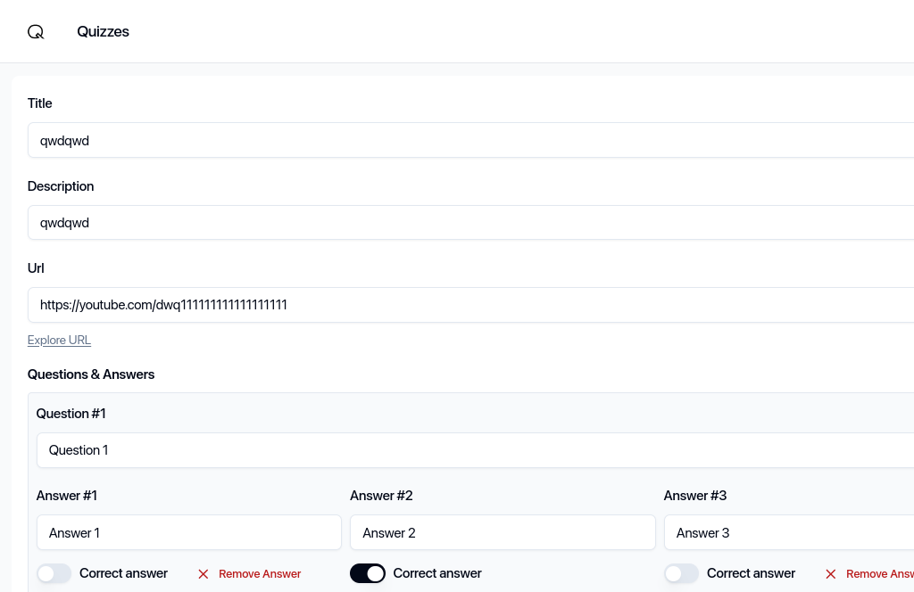
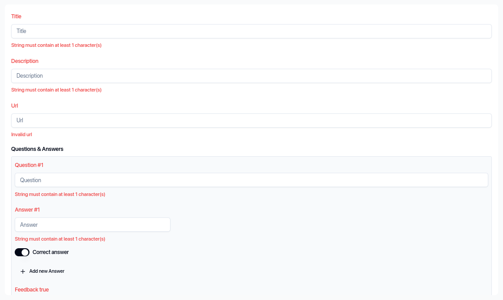
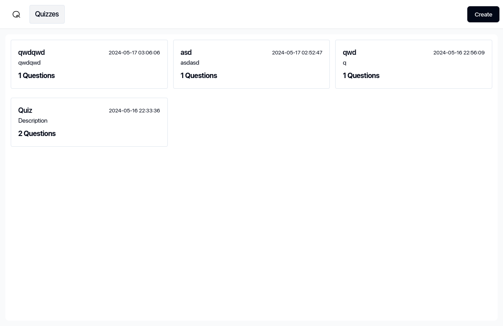

# Quiz Creator 📝🎉
This project was undertaken as part of a job application for Crocosoft. 🖥️ 
[Live preview](https://crocosoft-mh-task.vercel.app/)

### Requirements 📋:
1. The quiz should include the following information:
   - Title 🏷️
   - Description 📄
   - Final score 🎯
   - URL (YouTube video) 📺
   
2. Questions should be organized in an array and include:
   - The question text ❓
   - Feedback to be displayed when the user answers correctly/incorrectly ✅❌
   
3. Answers should be listed in an array and include:
   - Answer metadata
   - Indication of whether the answer is correct or not ✔️❌
   - Only one correct answer per question
   
4. When creating a new quiz, do not assign any unique identifiers (IDs) to the quiz, questions, or answers.

5. When editing, assign unique IDs to each entity that has already been created.

6. When adding a new quiz, assume you have a local repository that automatically assigns IDs to each entity.

7. The initial interface should:
   - Display a list of all quizzes 🗒️
   - Provide options to add a new quiz or edit an existing one ➕🖊️
   
8. Utilize a global state management technique to handle the application's state.

### Features ✨:
- Quizzes are listed in order of the most recently modified ones first 🔢⬇️
- Quizzes can be quickly deleted ❌
- New quizzes can be created with an unlimited number of questions and answers ➕
- Only one correct answer can be selected per question, marking all other options as incorrect when one is marked as correct ❌✅✅
- Questions and answers can be deleted ❌
- Deletion of the correct answer is disabled ❌❌
- Deletion of the only question is disabled ❌
- Deletion of the only answer is disabled ❌
- The user interface is clean and user-friendly for creating and updating quizzes 🎨
- Quizzes can be updated 🔄
- Input fields are thoroughly validated with appropriate types ✅❌🔢
- The application is fully accessible via keyboard ♿
- The design is fully mobile-friendly 📱

### Technologies 💻:
- Vite ⚡️
- Typescript 📝 (Fully compatible with TypeScript)
- React.js v18 ⚛️
- React Router DOM v6 🌐
- Tailwind 🌈
- Shadcn 🌑
- Hookform 🎣
- Zod (form validation) ✅
- Zustand (State management system) 🔄

### Tools 🛠️:
- Ubuntu (Operating System) 🐧
- VS Code (Code Editor) 💻
- Obsidian (Note-taking) 📓
- Brave (Web Browser) 🌐

### Additional Considerations 🌟:
- Robust error handling and clear error messages
- Responsive design for various screen sizes
- Efficient data storage and retrieval mechanisms
- Implementation of unit tests for critical functionality
- Integration with external APIs or services if necessary
- Regular updates and maintenance to ensure compatibility with future dependencies
- Clear documentation and well-commented code for easy maintenance and collaboration

### Screenshots 📷:

